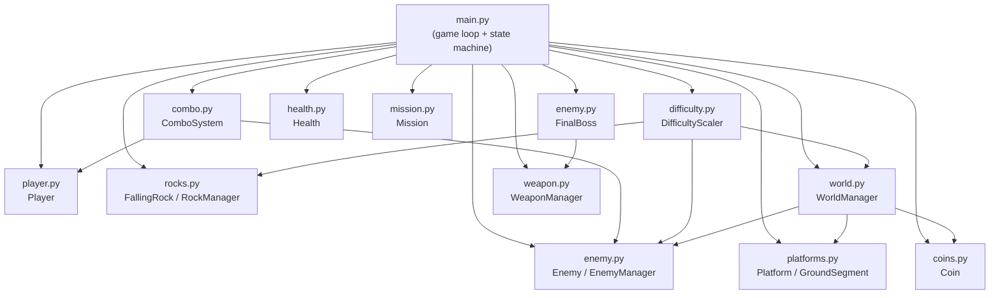

# Design Document — CoinStrike Game Improvements

## Overview

CoinStrike is a 2D side-scrolling platformer built with Python and Pygame. This design covers the implementation plan for all missing features and bug fixes needed to bring the game in line with the requirements document. The existing codebase provides a solid foundation (player movement, basic enemies, weapons, shop, missions, platforms, health), but several systems are entirely absent and a handful of bugs need correcting.

### Summary of Changes

| Area                        | Status  | Action                                                    |
| --------------------------- | ------- | --------------------------------------------------------- |
| Combo Kill System           | Missing | Add new `ComboSystem` class                               |
| Enemy Projectiles           | Missing | Add `EnemyProjectile` class + fire logic in `Enemy`       |
| Falling Rocks               | Missing | Add `FallingRock` + `RockManager` class                   |
| Difficulty Progression      | Missing | Add `DifficultyScaler` class                              |
| Final Boss                  | Missing | Add `FinalBoss` class extending `Enemy`                   |
| Mission Complete Screen     | Broken  | Fix `draw_mission_complete` + add QUIT button             |
| Mission target bug          | Bug     | Fix "Kill 15 enemies" target from 5 → 15                  |
| Player weapon sprites       | Missing | Load holding/running-holding sprites in `Player`          |
| `weapons_bought` tracking   | Bug     | Move to `WeaponManager.__init__`                          |
| Continuous world generation | Missing | Add `WorldManager` for streaming platforms/ground         |
| Coin placement continuity   | Bug     | Update `Coin._place_on_surface` to use live platform list |

---

## Architecture

The game follows a flat module architecture with a central `main.py` game loop. Each system is a class in its own module. The additions slot into this pattern without restructuring.



### State Machine

The existing state machine gains one new state:

```
MENU → PLAYING → GAME_OVER → MENU
                ↓
          BOSS_FIGHT (sub-state of PLAYING, triggered when all missions done)
                ↓
          MISSION_COMPLETE → MENU / PLAYING (restart)
```

`BOSS_FIGHT` is not a separate top-level state — it is a flag (`boss_active`) within `PLAYING` that changes enemy spawning and triggers the boss encounter.

---

## Components and Interfaces

### 1. `combo.py` — ComboSystem

Tracks consecutive kills and grants buffs.

```python
class ComboSystem:
    BONUS_THRESHOLD = 3       # combo >= 3 → bonus coins per kill
    BUFF_THRESHOLD = 5        # combo >= 5 → speed + damage buff
    BUFF_DURATION = 300       # frames
    INACTIVITY_TIMEOUT = 300  # frames without a kill → reset

    def __init__(self): ...
    def on_kill(self, player) -> int:
        """Call when an enemy dies. Returns bonus coins awarded (0 if below threshold)."""
    def on_damage_taken(self): ...
        """Resets combo and cancels buff immediately."""
    def update(self): ...
        """Tick inactivity timer; reset if timeout reached."""
    def is_buff_active(self) -> bool: ...
    @property
    def count(self) -> int: ...
    def draw(self, screen): ...
        """Render combo counter HUD element (top-center of screen)."""
```

**Buff effects** are stored as multipliers on `Player`:

- `player.speed_multiplier` (default 1.0, buff sets to 1.4)
- `player.damage_multiplier` (default 1.0, buff sets to 1.5)

`Player.update` uses `self.speed * self.speed_multiplier` for movement. `EnemyManager._check_bullets/spears/grenades` multiplies damage by `combo_system.damage_multiplier` when the buff is active.

### 2. Enemy Projectiles — `EnemyProjectile` in `enemy.py`

```python
class EnemyProjectile:
    BASE_SPEED = 5
    DAMAGE = 10
    RADIUS = 6

    def __init__(self, x, y, target_x, target_y, speed_multiplier=1.0): ...
    def update(self, ground_segments, platforms): ...
    def draw(self, screen, camera): ...
    @property
    def alive(self) -> bool: ...
```

Projectiles are fired from `Enemy` when in chase state and within a `SHOOT_RANGE` of 400 px, with a `SHOOT_COOLDOWN` of 180 frames. The `Enemy` class gains:

```python
self.shoot_timer = 0
SHOOT_RANGE = 400
SHOOT_COOLDOWN = 180
self.projectiles: list[EnemyProjectile] = []
```

`Enemy.update` fires a projectile toward the player's current position when conditions are met. `EnemyManager.update` calls `_check_projectile_hits(player, health)` to apply damage.

### 3. `rocks.py` — FallingRock / RockManager

```python
class FallingRock:
    GRAVITY = 0.6
    BASE_DAMAGE = 15
    RADIUS = 14

    def __init__(self, x, y): ...
    def update(self, ground_segments, platforms): ...
    def draw(self, screen, camera): ...
    @property
    def alive(self) -> bool: ...

class RockManager:
    BASE_INTERVAL = 300   # frames between spawns
    MIN_INTERVAL = 60

    def __init__(self): ...
    def update(self, camera, ground_segments, platforms, player, health,
               difficulty_scaler): ...
    def draw(self, screen, camera): ...
```

Rocks spawn at a random x within the visible camera window + 200 px margin, at y = -60 (above screen). `RockManager` uses `difficulty_scaler.rock_interval` to determine spawn frequency.

### 4. `difficulty.py` — DifficultyScaler

```python
class DifficultyScaler:
    def __init__(self): ...
    def update(self, game_frames: int): ...

    @property
    def enemy_spawn_interval(self) -> int:
        """420 → 120 frames, decreasing over ~10 minutes."""
    @property
    def projectile_speed_multiplier(self) -> float:
        """1.0 → 2.5, increasing over time."""
    @property
    def rock_interval(self) -> int:
        """300 → 60 frames."""
    @property
    def glitch_ratio(self) -> float:
        """0.30 → 0.70, used by WorldManager when generating new platforms."""
```

All values are computed from `game_frames` using a linear interpolation clamped to a maximum. This ensures monotonic scaling.

```python
def _lerp(self, start, end, t):
    return start + (end - start) * min(1.0, t)
```

`t = game_frames / SCALE_DURATION` where `SCALE_DURATION = 36000` (10 minutes at 60 fps).

### 5. `world.py` — WorldManager

Replaces the one-shot `generate_random_platforms` / `generate_ground_segments` calls with a streaming generator.

```python
class WorldManager:
    LOOKAHEAD = SCREEN_WIDTH * 2   # generate this far ahead of player

    def __init__(self, player, difficulty_scaler): ...
    def update(self, player, enemy_manager, coin_manager): ...
        """Extend platforms/ground when player approaches the right edge."""
    @property
    def platforms(self) -> list[Platform]: ...
    @property
    def ground_segments(self) -> list[GroundSegment]: ...
```

Old platforms/ground that are more than `SCREEN_WIDTH * 3` behind the camera are pruned to keep memory bounded. `EnemyManager` and `Coin` objects receive the live lists via reference so they always see the current world state.

### 6. `FinalBoss` in `enemy.py`

```python
class FinalBoss(Enemy):
    MAX_HP = 300
    ATTACK_DAMAGE = 30
    SHOOT_COOLDOWN = 60       # fires more frequently
    MULTI_SHOT_COUNT = 3      # fires 3 projectiles in a spread
    SPEED_MULTIPLIER = 1.5

    def __init__(self, x, y): ...
    def _fire_spread(self, player): ...
        """Fire MULTI_SHOT_COUNT projectiles in a spread pattern."""
    def update(self, platforms, ground_segments, player, health): ...
    def draw(self, screen, camera): ...
        """Draws a larger, visually distinct boss sprite."""
```

The boss is spawned by `main.py` when `mission.all_completed` becomes `True`. It is stored as `enemy_manager.boss` (a single instance, not in the regular `enemies` list). When `boss.hp <= 0`, `game_state` transitions to `MISSION_COMPLETE`.

### 7. Mission Complete Screen Fix

`draw_mission_complete` in `main.py` is refactored to:

- Return both `restart_rect` and `quit_rect`
- Handle clicks in the draw phase (not the event handler)
- Add a QUIT button that returns to the main menu

```python
def draw_mission_complete(screen, mouse_pos) -> tuple[Rect, Rect]:
    # ... renders RESTART and QUIT buttons
    return restart_rect, quit_rect
```

### 8. Player Weapon Sprites

`Player.__init__` loads 12 sprites total (4 base + 4 holding-idle + 4 holding-run):

```python
# Holding sprites (idle)
self.hold_idle_right = {
    "gun": ..., "spear": ..., "grenade": ...
}
self.hold_idle_left = { ... }
# Holding sprites (running)
self.hold_run_right = { ... }
self.hold_run_left = { ... }
```

`Player.update` selects the sprite based on `(running, facing_right, held_weapon)`. The `draw_held_weapon` call in `weapon.py` is removed since the weapon is now baked into the player sprite.

---

## Data Models

### ComboSystem State

```python
@dataclass
class ComboState:
    count: int = 0
    inactivity_timer: int = 0
    buff_timer: int = 0        # > 0 means buff is active
    buff_active: bool = False
```

### DifficultyScaler State

```python
@dataclass
class DifficultyState:
    game_frames: int = 0
    # All derived values computed from game_frames via lerp
```

### FallingRock State

```python
@dataclass
class RockState:
    x: float
    y: float
    vel_y: float = 0.0
    alive: bool = True
    damage: int = 15
```

### EnemyProjectile State

```python
@dataclass
class ProjectileState:
    x: float
    y: float
    dx: float
    dy: float
    alive: bool = True
    damage: int = 10
```

### WorldManager State

```python
@dataclass
class WorldState:
    platforms: list[Platform]
    ground_segments: list[GroundSegment]
    rightmost_platform_x: int
    rightmost_ground_x: int
```

---

## Correctness Properties

_A property is a characteristic or behavior that should hold true across all valid executions of a system — essentially, a formal statement about what the system should do. Properties serve as the bridge between human-readable specifications and machine-verifiable correctness guarantees._

### Property 1: Gravity is applied uniformly

_For any_ initial vertical velocity `vel_y`, after one physics tick the new velocity SHALL equal `vel_y + gravity` (0.8 for player, 0.6 for rocks, 0.5 for grenades).

**Validates: Requirements 1.3, 11.3**

---

### Property 2: Damage decreases HP by the exact damage amount

_For any_ current HP value above 0 and any damage amount `d` where `d < hp` and the player is not invincible, after calling `take_damage(d)` the new HP SHALL equal `old_hp - d`.

**Validates: Requirements 2.2, 11.2**

---

### Property 3: Invincibility prevents all damage

_For any_ invincible_timer value > 0 and any damage amount, calling `take_damage` SHALL leave HP unchanged.

**Validates: Requirements 2.8**

---

### Property 4: Pit fall costs exactly 25 HP and triggers respawn

_For any_ player HP value `h` where `h > 25`, when the player's y exceeds the fall threshold, HP SHALL become `h - 25` and the player's position SHALL be reset to the last recorded respawn point.

**Validates: Requirements 2.4, 10.3, 10.4**

---

### Property 5: Coin collection increments counter by exactly 1

_For any_ overlapping player/coin pair, calling `collect_coin` SHALL increment `coins_collected` by exactly 1 and reposition the coin to a valid surface.

**Validates: Requirements 3.2, 3.3**

---

### Property 6: Combo counter increments on each kill without damage

_For any_ sequence of `n` consecutive enemy kills with no damage taken in between, the combo counter SHALL equal `n`.

**Validates: Requirements 5.1**

---

### Property 7: Combo bonus coins scale with combo count

_For any_ combo count `c >= 3`, defeating an enemy SHALL award `c` bonus coins in addition to the base coin reward.

**Validates: Requirements 5.2**

---

### Property 8: Combo buff activates at threshold and deactivates on damage

_For any_ combo count `c >= 5`, the Combo_Buff SHALL be active. _For any_ damage event while the buff is active, the buff SHALL immediately deactivate and combo SHALL reset to 0.

**Validates: Requirements 5.3, 5.4**

---

### Property 9: Combo resets after inactivity timeout

_For any_ combo count `c > 0`, after 300 frames pass without a kill, the combo counter SHALL equal 0.

**Validates: Requirements 5.5**

---

### Property 10: Shop purchase deducts exact cost

_For any_ player coin count `coins >= price` and weapon price `price`, after a successful purchase `coins_collected` SHALL equal `coins - price`.

**Validates: Requirements 6.3**

---

### Property 11: Shop rejects purchase when coins are insufficient

_For any_ player coin count `coins < price`, attempting a purchase SHALL leave `coins_collected` unchanged and SHALL NOT grant the weapon.

**Validates: Requirements 6.4**

---

### Property 12: Weapon damage values are exact

_For any_ enemy HP value `h > 0`:

- A bullet hit SHALL reduce HP by exactly 3
- A spear hit SHALL reduce HP by exactly 5
- A grenade explosion within 90 px SHALL reduce HP by exactly 5

**Validates: Requirements 7.3, 7.4, 7.5**

---

### Property 13: Enemy AI state is determined by distance

_For any_ enemy/player pair, if the distance between them is less than 260 px the enemy state SHALL be "chase"; if the distance is 260 px or more the enemy state SHALL be "patrol".

**Validates: Requirements 8.2, 8.3**

---

### Property 14: Enemy contact damage is exactly 20 HP

_For any_ enemy/player contact where the player is not invincible and the attack cooldown has elapsed, the player SHALL lose exactly 20 HP.

**Validates: Requirements 8.4**

---

### Property 15: Difficulty values scale monotonically with time

_For any_ two game frame counts `t1 < t2`:

- `enemy_spawn_interval(t1) >= enemy_spawn_interval(t2)`
- `projectile_speed_multiplier(t1) <= projectile_speed_multiplier(t2)`
- `rock_interval(t1) >= rock_interval(t2)`
- `glitch_ratio(t1) <= glitch_ratio(t2)`

**Validates: Requirements 12.1, 12.2, 12.3, 12.4**

---

## Error Handling

### Missing Asset Files

All `pygame.image.load` calls are wrapped in try/except. If a sprite file is missing, a colored rectangle fallback is used. This prevents crashes when weapon-holding sprites are not present.

### World Generation Edge Cases

- `WorldManager` ensures at least one ground segment is always within the player's visible area.
- Platform generation clamps vertical positions to `[80, SCREEN_HEIGHT - 60]` to prevent unreachable platforms.
- If no valid spawn surface exists for a coin or enemy, the spawn is skipped silently.

### Boss Spawn

The boss is only spawned once. A `boss_spawned` flag on `EnemyManager` prevents duplicate spawns if `mission.all_completed` remains True across multiple frames.

### Combo System

`ComboSystem.on_kill` is idempotent for the same kill event — `EnemyManager` passes the kill signal exactly once per enemy death using the existing `just_died` flag.

### Difficulty Scaler

All lerp outputs are clamped to their defined min/max ranges, so no value can go negative or exceed its maximum regardless of `game_frames` input.

---

## Testing Strategy

### Unit Tests (example-based)

These cover specific constants, state transitions, and UI interactions:

- `test_player_jump_velocity`: verify `vel_y == -12` after jump
- `test_mission_target_15`: verify "Kill 15 enemies" target is 15, not 5
- `test_weapons_bought_initialized`: verify `WeaponManager.weapons_bought == 0` at init
- `test_mission_complete_has_quit_button`: verify `draw_mission_complete` returns two rects
- `test_boss_spawns_on_mission_complete`: verify boss appears when all missions done
- `test_boss_hp_greater_than_enemy`: verify `FinalBoss.MAX_HP > Enemy.MAX_HP`
- `test_glitch_platform_shake_timer`: verify shake_timer == 50 on first stand
- `test_glitch_platform_gone_timer`: verify gone_timer == 180 after disappear

### Property-Based Tests

Using [Hypothesis](https://hypothesis.readthedocs.io/) (Python PBT library). Each test runs a minimum of 100 iterations.

**Feature: coinstrike-game, Property 1: Gravity is applied uniformly**

```python
@given(vel_y=st.floats(min_value=-50, max_value=50))
def test_gravity_applied_uniformly(vel_y):
    # Apply one physics tick, verify vel_y increases by gravity constant
```

**Feature: coinstrike-game, Property 2: Damage decreases HP by exact amount**

```python
@given(hp=st.integers(min_value=1, max_value=100),
       damage=st.integers(min_value=1, max_value=99))
def test_damage_decreases_hp(hp, damage):
    # assume damage < hp; verify new_hp == hp - damage
```

**Feature: coinstrike-game, Property 3: Invincibility prevents all damage**

```python
@given(invincible_timer=st.integers(min_value=1, max_value=90),
       damage=st.integers(min_value=1, max_value=100))
def test_invincibility_blocks_damage(invincible_timer, damage):
    # verify hp unchanged when invincible_timer > 0
```

**Feature: coinstrike-game, Property 4: Pit fall costs 25 HP and triggers respawn**

```python
@given(hp=st.integers(min_value=26, max_value=100))
def test_pit_fall_costs_25_hp(hp):
    # trigger fall, verify hp == hp - 25 and position reset
```

**Feature: coinstrike-game, Property 5: Coin collection increments counter by 1**

```python
@given(initial_coins=st.integers(min_value=0, max_value=1000))
def test_coin_collection_increments_by_one(initial_coins):
    # overlap coin with player, verify coins == initial_coins + 1
```

**Feature: coinstrike-game, Property 6: Combo counter increments on each kill**

```python
@given(kill_count=st.integers(min_value=1, max_value=20))
def test_combo_increments_per_kill(kill_count):
    # simulate kill_count kills without damage, verify combo == kill_count
```

**Feature: coinstrike-game, Property 7: Combo bonus coins scale with combo count**

```python
@given(combo=st.integers(min_value=3, max_value=20))
def test_combo_bonus_coins(combo):
    # set combo to value, kill enemy, verify bonus_coins == combo
```

**Feature: coinstrike-game, Property 8: Combo buff activates at threshold and deactivates on damage**

```python
@given(combo=st.integers(min_value=5, max_value=20))
def test_combo_buff_activates_and_deactivates(combo):
    # set combo >= 5, verify buff active; take damage, verify buff inactive and combo == 0
```

**Feature: coinstrike-game, Property 9: Combo resets after inactivity**

```python
@given(combo=st.integers(min_value=1, max_value=20))
def test_combo_resets_after_inactivity(combo):
    # set combo, advance 300 frames without kills, verify combo == 0
```

**Feature: coinstrike-game, Property 10: Shop purchase deducts exact cost**

```python
@given(coins=st.integers(min_value=30, max_value=1000),
       weapon=st.sampled_from([("spear", 30), ("gun", 100), ("grenade", 150)]))
def test_shop_purchase_deducts_cost(coins, weapon):
    # assume coins >= price; purchase, verify coins_collected == coins - price
```

**Feature: coinstrike-game, Property 11: Shop rejects insufficient coins**

```python
@given(weapon=st.sampled_from([("spear", 30), ("gun", 100), ("grenade", 150)]),
       coins=st.integers(min_value=0, max_value=29))
def test_shop_rejects_insufficient_coins(weapon, coins):
    # assume coins < price; attempt purchase, verify coins unchanged
```

**Feature: coinstrike-game, Property 12: Weapon damage values are exact**

```python
@given(hp=st.integers(min_value=4, max_value=300))
def test_bullet_damage_is_3(hp):
    # apply bullet hit, verify hp -= 3
```

**Feature: coinstrike-game, Property 13: Enemy AI state determined by distance**

```python
@given(distance=st.floats(min_value=0, max_value=500))
def test_enemy_ai_state_by_distance(distance):
    # place enemy and player at given distance, update, verify state
```

**Feature: coinstrike-game, Property 14: Enemy contact damage is 20 HP**

```python
@given(hp=st.integers(min_value=21, max_value=100))
def test_enemy_contact_damage_is_20(hp):
    # overlap enemy with non-invincible player, verify hp -= 20
```

**Feature: coinstrike-game, Property 15: Difficulty scales monotonically**

```python
@given(t1=st.integers(min_value=0, max_value=35999),
       t2=st.integers(min_value=0, max_value=36000))
def test_difficulty_monotonic(t1, t2):
    # assume t1 < t2; verify all four scaling properties hold
```
